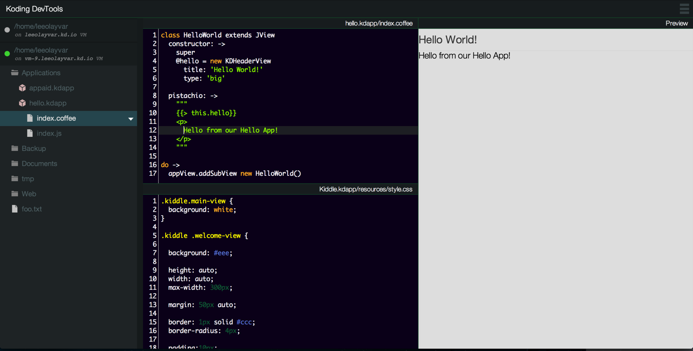

# Hello World

We previously talked about what [Koding][0] Apps are, now lets create a
classic Hello World application.

## Creating a Hello World application

As we've seen, there are two required files that need to be created for an app
to exist. Lets create a very stripped down version of these files.

First, create a directory located at `~/Applications/hello.kdapp`,
and navigate there.

### Source Code

Next, create a file called `index.coffee` in your app directory, and copy
the following source code into it.

```coffee
class HelloWorld extends JView
  constructor: ->
    super
    @hello = new KDHeaderView
      title:  'Hello World!'
      type:   'big'

  pistachio: ->
    """
    {{>this.hello}}
    <p>
      Hello from our Hello App!
    </p>
    """

do ->
  appView.addSubView new HelloWorld()
```


This source is short of a "complete" app, but it will get feet went and help us 
understand the basics. So, lets break down the above source.  

#### HelloWorld and Views

Views are Kodings way of programatically representing the DOM. Allowing you
to define elements and modify them all from your code. In the above code,
`KDHeaderView` will be literally compiled to `<h1>Hello World!</h1>`. You
can modify these views by adding css, changing their content, adding subviews,
or even removing them entirely at a later time.

The HelloWorld class will be what we tell Koding is our extension of a
Koding View. You can see that it extends `JView`, which is a Koding View.

#### JView and Pistachio

As we mentioned, `JView` is a Koding View. It extends `KDView`,
but adds Pistachio templating functionality. [Pistachio][2] is a templating 
language which is similar to Handlebars, and you can readup on it if you like.

The important thing to note here, is that `JView` and Pistachio *are entirely
optional*. I included them here to show multiple ways of adding content
to Koding Views. I could have included the `KDHeaderView` directly and
not used `JView` at all.

#### Do and appView

The `do` usage here is a bit irrelevant, but many Coffee users forget what
it actually *does*. `do ->` simple creates a javascript closure and executes
the given function immediately.

`appView` on the otherhand, is the real hero of this whole code. We've
explained that Koding uses views, and uses them everywhere, so it makes sense
that we need to add our main view, to another view. That's what `appView` is.

`appView` is provided in our applications scope, by Koding, and we need to add 
our application to it. This can be done with the method that all Views have,
`KDView.prototype.addSubView()`. We use it here, to add an instance of
our `HelloWorld` class to our apps container view.

### Compiling with DevTools

Compiling can be done in a number of ways, but we're going to focus on the 
easiest: Koding's [DevTools][6]. All we have to do with DevTools open it up, 
and then from the FileTree on the left hand side locate our `index.coffee`
file and open it up.  

Once your `index.coffee` file is open, DevTools will automatically compile it 
in the right hand side. It should look similar to the following image:



## Extending Functionality

Now that you have your app loaded, lets make some changes. Lets add a button to 
our application! Exciting right?

Since we'll likely want to have this button call a function in our code, we're 
going to create it using KDViews. Specifically, the `KDButtonView`. Take the 
following code, and insert it right below your `@hello` declaration.

```coffee
    @button = new KDButtonView
      title:     'Click Me!'
      callback:  ->
        alert 'Clicked :)'
```

Now, save your `index.coffee` file.

**Remember**: In CoffeeScript, indentation matters. So make sure this is 
indented so that `@button` and `@hello` are at the same indentation level.

### Adding it to Pistachio

You're likely noticing that nothing is showing up. Your button is not on the 
right side, being all amazing and button like. What's wrong?

Well, remember that our `HelloWorld` class extends JView. That means all of our 
Views are being render through `JView`, and if it's not in the `pistachio()` 
method than it doesn't render.

So, lets add it to Pistachio! Locate the `pistachio` method and add the 
following code within the string block.

```coffee
    {{>this.button}}
```

And just like that, you have a button. If you click it, you can see the 
Callback code firing as well, popping up and awesomely annoying `alert` box :)

## Putting it all together

After you've added your button, it should look like the following code:

```coffee
class HelloWorld extends JView
  constructor: ->
    super
    @hello = new KDHeaderView
      title:  'Hello World!'
      type:   'big'

    @button = new KDButtonView
      title:     'Click Me!'
      callback:  ->
        alert 'Clicked :)'

  pistachio: ->
    """
    {{>this.hello}}
    <p>
      Hello from our Hello App!
    </p>
    {{>this.button}}
    """

do ->
  appView.addSubView new HelloWorld()
```

And if you got it all right, why not play around some more? As always, refer to 
[the API][3] for additional class names to add into your code!

## In Closing

You should now know what Koding Applications are made of, what they are made
with, and how to make a basic Hello World application.

In the [next installation][4], we'll take this a step further and see a 
Manifest, a slightly more complex App, and take a sneak peak at publishing your 
awesome app. [Check it out!][4]


[0]: https://koding.com
[1]: http://coffeescript.org
[2]: https://github.com/phidelta/pistachio
[3]: ../api
[4]: ./03-devtools-example.md

